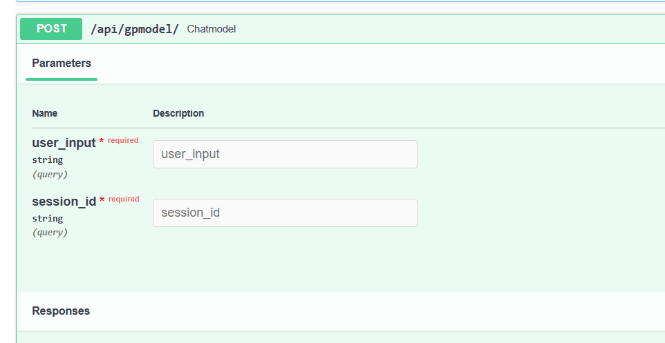

# Klustherthon DiagnoBuddy

This api provides a drug diagnosis response bot system which returns a text based on the users input (health complains).

Head over to https://diagnobuddy.azurewebsites.net/docs to use the api interactively from the browser.



To use the API from an api client like postman:
- API-   https://diagnobuddy.azurewebsites.net/api/gpmodel
- Method - POST
- Paylod (query parameters)
```json
{
  "user_input": "What are the side effects of bactrim ?",
  "session_id": "side_effects, drug_classes"
}
```
**user_input: str**,This is the user message passed to the LLM

**session_id: str** session id sent from backend application to track users messages and feed to LLM for memory conversation.


```python
expected response
{"AI_out": "Bots generated message"}
#status_code: 200
```


### Alternative endpoints
alternative endpoints langchain with openai's LLM https://diagnobuddy.azurewebsites.net/api/langchainmodel and Facebook llama2 https://diagnobuddy.azurewebsites.net/llama2model were built as alternative for faster response and better result. Currently the endpoint with the best out is the gptmodel endpoint, tho a bit slower compared to llama2. for future developments, users can be refered to any of the endpoints based on their preference.

